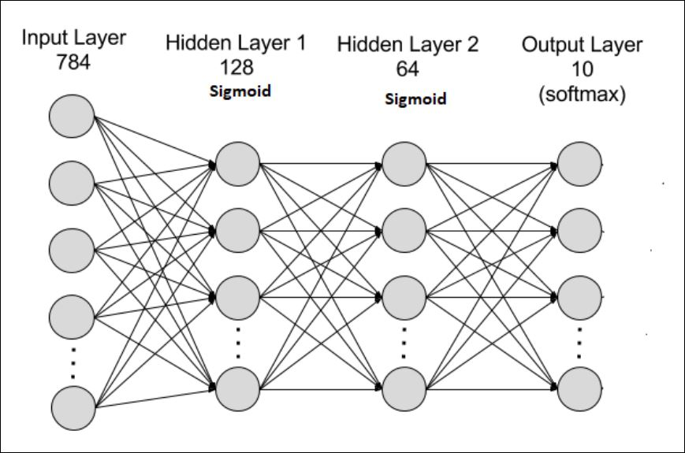
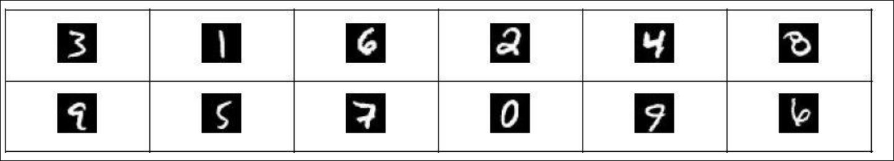
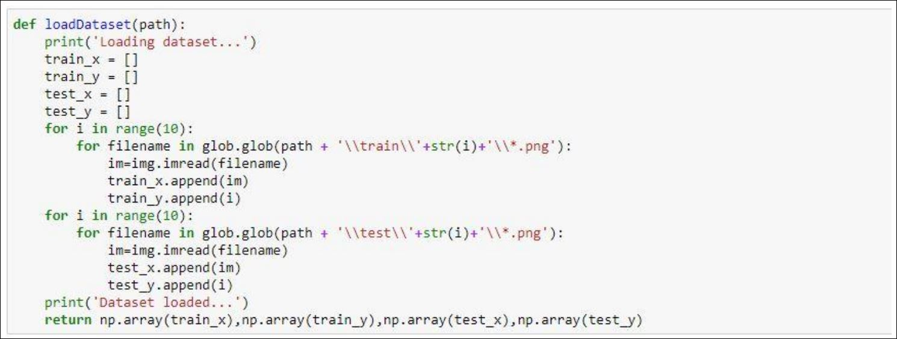
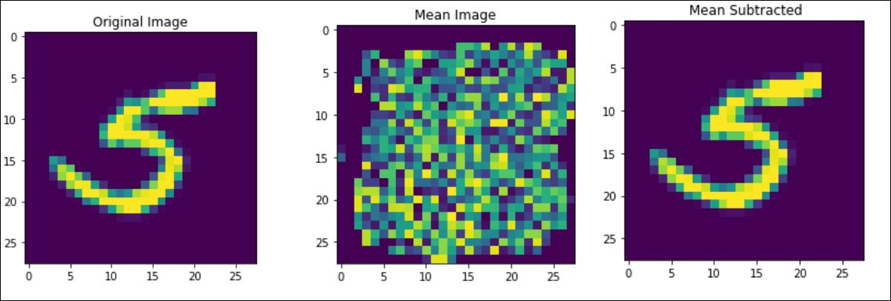

# Multi-layer-Neural-Network-for-multi-class-classification-of-MNIST-dataset-using-Softmax
It is implementation of multi-layer neural network for multi class classification of MNIST dataset using Python language. You can understand the working of softmax. 
Implementation of multi-layer Neural Network for multi-class classification.
In this part, we will create a complete network architecture consisting of multiple layers. We were required to report results with 2 hidden layers on MNIST dataset. Following is the architecture of our network as shown in the below diagram.

### MNIST Dataset:
The dataset is attached with the code in Data folder. This dataset contains 60000 training and 10000 test examples. Each example is of 784x1 sizes, which is in vectorized form of 28x28 (2D grayscale) images. There are 10 classes in which each sample is an image of one of the digits (0 to 9). Please note that in MNIST dataset there are 10 categories. If we randomly guess one category, there’s 1/10 probability that it would be correct. Therefore, we couldn't (theoretically) make a classifier that performs worse than that. If we'd get less than 10% accuracy in any of our experiments, we can safely assume that we are doing something fundamentally wrong.
Function to load Dataset:
train_set_x, train_set_y, test_set_x, test_set_y =load_dataset (path_to_dataset)

Figure: Sample Images from the Dataset

### NOTE:
  - train_set_x and test_set_x are numpy arrays of shape (m_train, num_px,num_px, 1)and (m_test, )respectively, where m_train is total number of train or test images, and num_px is the width and height of images that is 28 in case of MNIST.
  - *_set_x : is being used for the sample
  - *_set_y : is being for label of the sample.
  - The dimension of train_set_y and test_set_y is (m_train, 1) and (m_test , ) respectively
  - Each row of our train_set_x and test_set_x is an array representing an image.
  
- To verify that all the data is loaded print the dimension of each variable and we should get the following outputs:
  - train_set_x shape: (60000, 28, 28, 1)
  - test_set_x shape: (10000, 28, 28, 1)
  - train_set_y shape: (60000, 1)
  - test_set_y shape: (10000, 1)
### Vectorization of Samples:
To input sample in the neural network, we need to convert 2D matrix into a one dimensional vector. That is reshape our images of shape (num_px, num_px, 1) to a numpy-array of shape (num_px*num_px, 1). After reshaping, our training and test dataset should be a numpy-array where each column represents a flattened image. The dimension of the data should be:
  - Train_set_x_flatten shape: (60000, 784)
  - Test_set_x_flatten shape: (10000, 784)

### Mean Image Subtraction:
There are many ways to do mean subtraction but here we are using mean image subtraction. Mean Image Subtraction is the technique to whitening the dataset. We compute mean of the whole dataset and subtract our data from that mean. In case of MNIST dataset example is given below:

Mean subtraction will translate our dataset to the mean of the whole data.
### Dropout:
### Data preprocessing
  - data = meanSubtraction(data)
  - Note that this function must be called before splitting data into train, test and validation set.
### Initialize Network
net = init_network(no_of_layers, input_dim, neurons_per_layer)
For example if you pass following parameters to this function:
net = init_network(2, 784, [100, 50, 10])
It should return you the network architecture with parameters initialized:
Size of net(1).w = 784x100
Size of net(1).b = 100
Size of net(2).w = 100x50
Size of net(2).b = 50
Size of net(3).w = 50x10
Size of net(3).b = 10
You should add the empty arrays in each layer to store the activations and local gradients of each layer; this will help you in back-propagation.
### Training
net = train_sgd(net, train_set_x, train_set_y, test_set_x,
test_set_y, learning_rate, drop_out, batch_size, training_epochs)
  - This function returns a trained Neural Network net
  - net network architecture
  - train_set_x input training data of MxN size. where M is the feature dimension which is 784 for MNIST, and N is the number of training examples
  - train_set_y 1xN array containing class labels i.e. [0,1,2,..,9]
  - test_set_x and test_set_y will be used for validation
  - learning_rate as the name suggest, learning rate of your Neural Network
  - drop_out to randomly shuts down some neurons in each iteration.
  - batch_size tells how many examples to pick for each iteration e.g. 20
  - training_epochs how many training epochs to run.
Please make sure your code is modular. You can divide your training process into following function
  - feed-forward - this function will forward through (the network) your input examples
and will also compute local gradients along the way at each layer
  - back-prop - this function will traverse network backwards and keep
  - back propagating the loss ? multiplying gradients from above to the current local gradients
  - validate/test - function will test how well your network is doing in terms of loss and accuracy.
You need to convert the labels to one hot encoding, because we now have 10 classes and their labels are 0,1,2,3...and 9. For each training sample you need to generate a vector of length 10, whose all indices will be zeros except the index of its original label that will be 1.
For example:

### Feed Forward step
net = feedForward(net, batch_data, keep_prob)
i ( i)
i T i
a sigmoid z
z w x b

Perform these two operations on all the layers and store the value of a in net(layer). a, at this step also store the value of derivative of your activation function in net(layer), local_grad. 
### Back Propagation Step
[net cost] = backPropagation(net, batch_label, batch_size,
learningRate, keep_prob)
The first step here, you will apply the soft-max on the output layer. Now for each input example you have 10 output probabilities and you also have its label vector of same length.
You have to implement softmax at last layer and calculate cross-entropy loss.
Once you have calculated the loss you can compute the gradients dw at any layer using the equations we discussed in class. Please note that you will essentially be running in reverse order. Store dw and db for each layer.
### Updation Step
[net] = sgd (net, dw, db, learning_rate)
Again here you will be running a for loop by iterating layers from first to last and update the weights using update rule.
net(i).w = net(i).w - (learning_rate * dW(i))
net(i).b = net(i).b - (learning_rate * dB(i))
### Validation Step
[net] = test(net, test_set_x, test_set_y)
Since you have updated your weights for 1 epoch, now perform feedforward step on your test data and compute the loss. After every epoch plot the training loss and validation loss.

